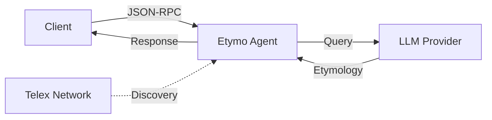

# Etymo Agent

Welcome to **Etymo Agent** — an AI-powered etymology agent built on the [Telex A2A protocol].

## Overview

Etymo Agent provides word etymology information through a JSON-RPC API that follows the Agent-to-Agent (A2A) communication standard. Simply send a word, and receive its historical origin, meaning evolution, and linguistic journey.

## Key Features

- **Telex A2A Compatible**: Fully compliant JSON-RPC 2.0 endpoint
- **LLM-Powered**: etymology analysis using modern language models
- **Simple Integration**: RESTful API with clear request/response structure
- **Self-Documenting**: Exposes `/.well-known/agent.json` for automatic discovery
- **Fast & Lightweight**: Built with FastAPI for high performance

## Quick Example

```bash
curl -X POST https://agent.com/ \
  -H 'Content-Type: application/json' \
  -d '{
    "jsonrpc": "2.0",
    "method": "message/send",
    "id": 1,
    "params": {
      "message": {
        "role": "user",
        "parts": [{"kind": "text", "text": "philosophy"}],
        "kind": "message"
      }
    }
  }'
```

**Response:**

```json
{
  "jsonrpc": "2.0",
  "id": 1,
  "result": {
    "role": "agent",
    "parts": [{
      "kind": "text",
      "text": "Philosophy comes from Greek 'philosophia', combining 'philo-' (love) and 'sophia' (wisdom). Literally: 'love of wisdom'..."
    }],
    "kind": "message",
    "messageId": "uuid-here"
  }
}
```

## Use Cases

- **Educational Tools**: Enhance vocabulary learning apps
- **Writing Assistants**: Provide context for word choice
- **Language Research**: Automate etymology lookups
- **Content Creation**: Enrich articles with word origins
- **Chat Integrations**: Add etymology skills to AI assistants

## Architecture



## Next Steps

- :material-clock-fast:{ .lg .middle } **Get Started in 5 Minutes**

    ---

    Install dependencies and run your first query

    [:octicons-arrow-right-24: Quickstart](quickstart.md)

- :material-api:{ .lg .middle } **API Documentation**

    ---

    Learn about endpoints, methods, and data formats

    [:octicons-arrow-right-24: API Reference](api.md)

## Requirements

- Python 3.10+
- [uv](https://docs.astral.sh/uv/) for dependency management
- OpenAI-compatible LLM endpoint (OpenAI, Anthropic, or local)
- Environment variables for API keys

## Community & Support

- **Issues**: [GitHub Issues](https://github.com/Rifushigi/etymo/issues)
- **Discussions**: [GitHub Discussions](https://github.com/Rifushigi/etymo-agent/discussions)
- **Email**: <rifushigi.teda@gmail.com>

---

Built by [rifushigi]
